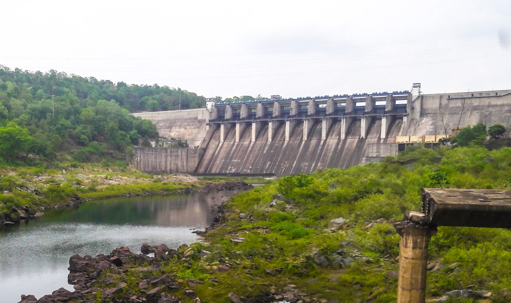
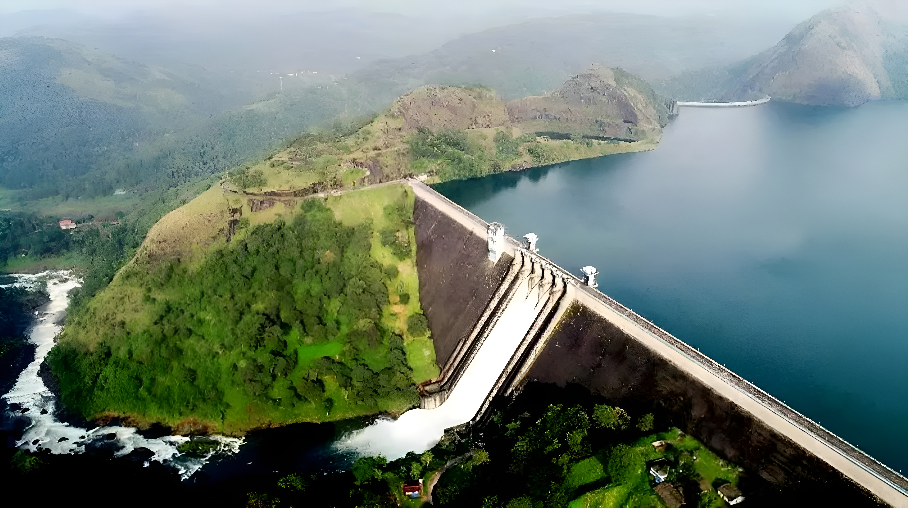

# Harmony in Hydrology: Integrating Chhattisgarh and Kerala with Dams

## Acknowledgement

I, Aayush Patre, a student of Class 10th 'C' at Maharishi Vidya Mandir, Mangla, would like to express my sincere gratitude to my science teacher, Mrs. Rashmi Jain, for her guidance and support throughout the completion of this project. I am also grateful to my school, Maharishi Vidya Mandir, Mangla, and our principal, Mrs. Reena Singh, for providing an environment that fosters learning and creativity. I would like to acknowledge the Central Board of Secondary Education (CBSE) for initiating the "Ek Bharat Shreshtha Bharat" scheme, which has given me the opportunity to explore the fascinating world of dams and their role in connecting different regions of our country.

## Introduction

India is a diverse nation with a rich cultural heritage and varied geographical features. The "Ek Bharat Shreshtha Bharat" initiative aims to celebrate this diversity by fostering a spirit of national integration through mutual understanding and appreciation of the unique aspects of different states and regions. In this project, we will explore the role of dams in connecting two distinct states, Chhattisgarh and Kerala, by examining the Hasdeo Bango Dam in Chhattisgarh and the Idukki Dam in Kerala. Dams play a crucial role in water management, flood control, and electricity generation, making them vital components of a region's infrastructure. By studying these two dams, we will gain insights into the engineering marvels that help sustain the lives of millions of people in both states.

## Hasdeo Bango Dam, Chhattisgarh

The Hasdeo Bango Dam is a multi-purpose water project constructed in 1961-62 across the Hasdeo River in Chhattisgarh, India. It is the longest and widest dam in the state, located 70 km from Korba in the Korba district. The dam has a catchment area of 6,730 km² and an effective storage capacity of 2.89 cubic kms (102.07 tmc ft). It has the capacity to generate 120 MW of electricity.

The Hasdeo River originates at an elevation of 910 meters above sea level, about 10 km from Sonhat in the Koriya district. The river has a total length of 333 km. The dam was built to serve multiple purposes, including irrigation, flood control, and power generation. It has played a significant role in the development of the region by providing water and electricity to the surrounding areas.

## Idukki Dam, Kerala

The Idukki Dam is a double curvature arch dam built across the Periyar River in Kerala, India. It is the tallest arch dam in Asia, standing at a height of 169 meters. The dam was completed in 1975 and was inaugurated by the then Prime Minister of India, Indira Gandhi. The construction of the dam cost approximately INR 480 million.

The Idukki Dam is a part of the Idukki Hydroelectric Project, which also includes two other smaller dams, the Cheruthoni and Kulamavu dams. The project has a total installed capacity of 780 MW, making it one of the largest hydroelectric projects in India. The dam serves multiple purposes, including power generation, irrigation, and flood control.

## Comparison and Integration

Both the Hasdeo Bango Dam and the Idukki Dam are engineering marvels that have significantly contributed to the development of their respective regions. While the Hasdeo Bango Dam is the longest and widest dam in Chhattisgarh, the Idukki Dam holds the distinction of being the tallest arch dam in Asia. Both dams serve multiple purposes, including power generation, irrigation, and flood control.

The integration of Chhattisgarh and Kerala through these dams can be achieved by sharing knowledge, expertise, and best practices in dam construction, operation, and maintenance. This collaboration can lead to the development of more efficient and sustainable dam projects in both states, benefiting millions of people who rely on these dams for their livelihoods.

Furthermore, the two states can collaborate on research and development initiatives to explore innovative technologies and methods for dam construction and management. This can include the use of renewable energy sources, such as solar and wind power, to supplement the electricity generated by the dams. Additionally, the states can work together to develop eco-friendly tourism initiatives that showcase the beauty and engineering prowess of these dams while promoting environmental conservation and sustainable development.

 

## Conclusion

In conclusion, the Hasdeo Bango Dam in Chhattisgarh and the Idukki Dam in Kerala are prime examples of how dams can play a crucial role in the development of a region. By integrating the knowledge, expertise, and best practices of both states, we can foster a spirit of national integration and mutual understanding, as envisioned by the "Ek Bharat Shreshtha Bharat" initiative. This collaboration can lead to the development of more efficient and sustainable dam projects, benefiting millions of people who rely on these dams for their livelihoods. Furthermore, it can pave the way for innovative research and development initiatives, as well as eco-friendly tourism opportunities that showcase the beauty and engineering prowess of these dams while promoting environmental conservation and sustainable development.

## References

"Wikipedia": https://en.wikipedia.org/wiki/Hasdeo_Bango_Dam

Power-technology.com: "https://www.power-technology.com/marketdata/power-plant-profile-hasdeo-bango-india/

"CSPC": https://cspc.co.in/cspc/cspgcl/powerstations/Hydel%20Plants/Bango/Hydel%20Plant%20Bango.htm

"Bharatpedia": https://en.bharatpedia.org/wiki/Hasdeo_Bango_Dam

"TripAdvisor": https://www.tripadvisor.com/Attraction_Review-g2322234-d6864707-Reviews-Bango_Dam-Korba_Korba_District_html.Chhattisgarh

The comlete list of direct links can be accessed online via https://github.com/5vr/schoolproject23/#references
